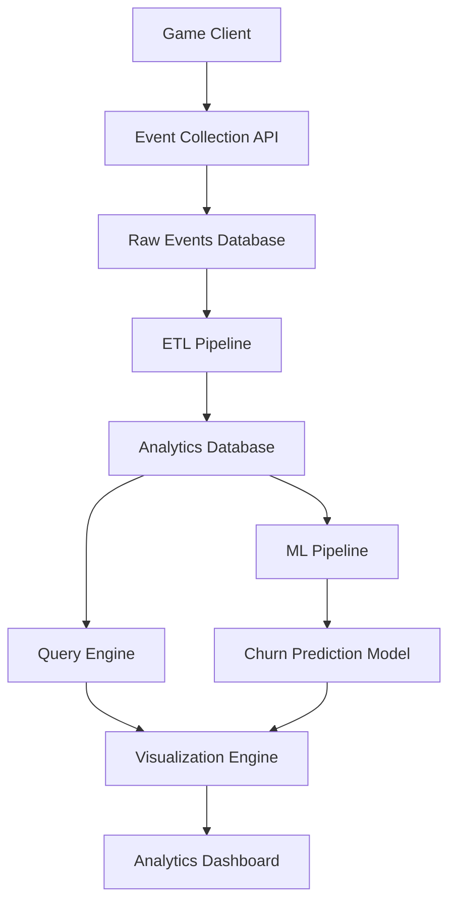

# Design Document

## Overview

The Player Retention Analytics system is designed as a modular, scalable solution that processes mobile game player data to provide insights into retention patterns and predict churn risk. The system follows a layered architecture with clear separation between data processing, machine learning, and presentation layers.

## Architecture

The system uses a three-tier architecture:

1. **Data Layer**: SQL database with optimized schemas for player events and analytics
2. **Processing Layer**: Python-based analytics engine with scikit-learn ML models
3. **Presentation Layer**: Interactive dashboard with Matplotlib-based visualizations



## Components and Interfaces

### Data Collection Component
- **Purpose**: Ingests player events from mobile game clients
- **Interface**: REST API endpoints for event submission
- **Storage**: Raw events stored in time-series optimized tables
- **Key Tables**:
  - `player_events`: timestamp, player_id, event_type, event_data
  - `player_sessions`: session_id, player_id, start_time, end_time, level_reached
  - `player_profiles`: player_id, registration_date, last_active, total_sessions

### ETL Pipeline Component
- **Purpose**: Transforms raw events into analytics-ready datasets
- **Processing**: Daily batch jobs to aggregate player metrics
- **Output**: Structured tables for retention analysis and ML features
- **Key Transformations**:
  - Daily/Weekly/Monthly active user calculations
  - Session duration and frequency metrics
  - Level progression and achievement tracking
  - Cohort assignment and retention calculations

### Machine Learning Component
- **Purpose**: Trains and serves churn prediction models
- **Framework**: scikit-learn with ensemble methods (Random Forest, Gradient Boosting)
- **Features**: 
  - Recency: days since last session
  - Frequency: sessions per week
  - Monetary: in-app purchases
  - Engagement: average session duration, levels completed
  - Social: friend connections, guild participation
- **Model Pipeline**:
  - Feature engineering and scaling
  - Model training with cross-validation
  - Hyperparameter tuning using GridSearchCV
  - Model evaluation and performance monitoring

### Analytics Query Engine
- **Purpose**: Provides optimized SQL queries for retention analysis
- **Interface**: Python functions wrapping parameterized SQL queries
- **Optimization**: Indexed views for common retention metrics
- **Key Queries**:
  - Cohort retention rates by registration date
  - Player lifecycle stage classification
  - Drop-off analysis by game level/feature
  - Segment-based retention comparisons

### Visualization Engine
- **Purpose**: Generates interactive charts and reports
- **Framework**: Matplotlib with custom styling for game analytics
- **Chart Types**:
  - Retention curves and cohort heatmaps
  - Player engagement timeline charts
  - Churn risk distribution histograms
  - Drop-off funnel visualizations
- **Interactivity**: Date range filters, player segment selection, drill-down capabilities

## Data Models

### Player Profile Model
```python
class PlayerProfile:
    player_id: str
    registration_date: datetime
    last_active_date: datetime
    total_sessions: int
    total_playtime_minutes: int
    highest_level_reached: int
    total_purchases: float
    churn_risk_score: float
    churn_prediction_date: datetime
```

### Retention Metrics Model
```python
class RetentionMetrics:
    cohort_date: date
    day_1_retention: float
    day_7_retention: float
    day_30_retention: float
    cohort_size: int
    segment: str
```

### Churn Features Model
```python
class ChurnFeatures:
    player_id: str
    days_since_last_session: int
    sessions_last_7_days: int
    avg_session_duration_minutes: float
    levels_completed_last_week: int
    purchases_last_30_days: float
    social_connections: int
    feature_date: date
```

## Error Handling

### Data Quality Issues
- **Missing Events**: Implement data validation with configurable thresholds
- **Duplicate Events**: Use event deduplication based on timestamp and player_id
- **Schema Changes**: Version-aware ETL pipeline with backward compatibility

### Model Performance Degradation
- **Accuracy Monitoring**: Daily model performance evaluation against holdout set
- **Drift Detection**: Statistical tests for feature distribution changes
- **Automatic Retraining**: Trigger model retraining when accuracy drops below 75%

### System Failures
- **Database Connectivity**: Connection pooling with automatic retry logic
- **Processing Failures**: Dead letter queues for failed ETL jobs
- **Visualization Errors**: Graceful degradation with cached results

## Testing Strategy

### Unit Testing
- **Data Processing**: Test ETL transformations with known input/output pairs
- **ML Pipeline**: Test feature engineering and model training components
- **Query Engine**: Validate SQL query results against expected outcomes
- **Visualization**: Test chart generation with mock data

### Integration Testing
- **End-to-End Pipeline**: Test complete flow from raw events to visualizations
- **Database Integration**: Test query performance with realistic data volumes
- **API Integration**: Test event collection endpoints with simulated game clients

### Performance Testing
- **Query Performance**: Benchmark retention queries with large datasets (1M+ players)
- **Model Training**: Measure training time and memory usage with production data
- **Visualization Rendering**: Test chart generation speed with various data sizes

### Model Validation
- **Cross-Validation**: 5-fold CV for model selection and hyperparameter tuning
- **Temporal Validation**: Train on historical data, validate on recent periods
- **A/B Testing**: Compare model predictions against actual churn outcomes
- **Bias Testing**: Evaluate model fairness across player segments